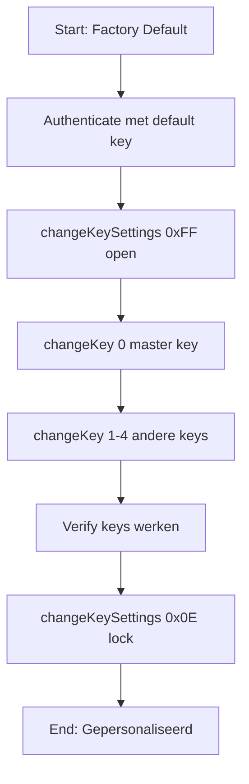

# ChangeKeySettings - Quick Reference

## ✅ Status: Volledig Geïmplementeerd

De `changeKeySettings()` functie is geïmplementeerd in [ntag424_handler.cpp](src/ntag424_handler.cpp) volgens **AN12196 § 6.17**.

---

## 📋 Belangrijkste Waarden

| Value | Naam | Gebruik | Bits Uitleg |
|-------|------|---------|-------------|
| **0xFF** | Volledig Open | Setup fase | Config changeable, ChangeKey FREE |
| **0x0E** | Volledig Locked | Productie | Config frozen, ChangeKey FROZEN |
| **0x08** | Managed Mode | Beheerd systeem | Config frozen, alleen key0 mag ChangeKey |

---

## 🔧 Basis Gebruik

```cpp
// 1. Authenticeer
NTAG424Handler::AuthResult authResult;
ntag424.authenticateEV2First(0, oldKey, authResult);

// 2. Open settings
ntag424.changeKeySettings(0xFF);

// 3. Change keys
ntag424.changeKey(0, oldKey, newKey);

// 4. Lock settings
ntag424.changeKeySettings(0x0E);  // ⚠️ PERMANENT!
```

---

## 🛡️ Safety Checks

### VÓÓR je 0x0E (lock) stuurt:
- ✅ Alle keys correct gewijzigd?
- ✅ Keys geverifieerd door test authenticatie?
- ✅ Backup van keys gemaakt?
- ⚠️  **Settings zijn daarna PERMANENT locked!**

### Check huidige status:
```cpp
uint8_t settings, maxKeys;
ntag424.getKeySettings(settings, maxKeys);

if ((settings & 0x07) == 0x0E) {
    Serial.println("⚠️ LOCKED - keys cannot be changed!");
}
```

---

## 📁 Bestanden

| Bestand | Doel |
|---------|------|
| [src/ntag424_handler.cpp](src/ntag424_handler.cpp) | Implementatie (line ~1184) |
| [include/ntag424_handler.h](include/ntag424_handler.h) | Header definitie |
| [CHANGEKEY_SETTINGS_GUIDE.md](CHANGEKEY_SETTINGS_GUIDE.md) | Volledige documentatie |
| [test_changekey_settings.cpp](test_changekey_settings.cpp) | Test voorbeelden |

---

## 🔍 Quick Debug

### Command Format
```
Cmd:     0x54
Encrypted: 16 bytes [KeySettings + CRC32 + padding]
MAC:     8 bytes
Total:   25 bytes
```

### Check Serial Output
```
[CHANGE KEY SETTINGS]
Settings:       0xFF
Full APDU:      54[encrypted][MAC]
```

### Mogelijke Errors
| SW Code | Betekenis | Oplossing |
|---------|-----------|-----------|
| 91CA | Command not allowed | Settings zijn frozen (bit 7=0) |
| 919D | Permission denied | Geen rechten voor ChangeKey |
| 91AE | Authentication error | Authenticeer opnieuw |

---

## 🎯 Personalisatie Sequence



**Waarschuwing:** Na stap G kunnen keys NOOIT meer gewijzigd worden!

---

## ❓ Vragen?

Zie volledige docs: [CHANGEKEY_SETTINGS_GUIDE.md](CHANGEKEY_SETTINGS_GUIDE.md)

Test voorbeelden: [test_changekey_settings.cpp](test_changekey_settings.cpp)

---

## 🔬 Technische Details

### Encryption
- **Algorithm**: AES-128 CBC
- **IV**: `E(SesEncKey, A55A || TI || CmdCtr || 00..00)`
- **Plaintext**: `[Settings:1] [CRC32:4] [Padding:11]`

### MAC  
- **Algorithm**: AES-CMAC (truncated to 8 bytes)
- **Input**: `Cmd || CmdCtr || TI || EncData` (23 bytes)
- **Key**: Session MAC Key

### Session State Updates
- `commandCounter++` na succesvol commando
- `currentIV = encrypted[0..15]` (laatste block)

